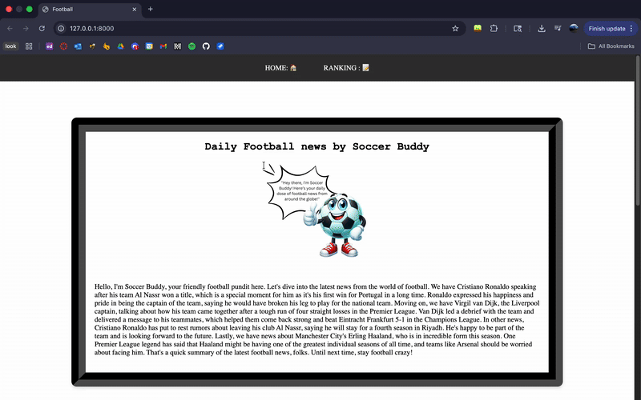

## ⚽ Soccer Digest

Soccer Digest is a Django-based web application that provides up-to-date information about Premier League teams, player squads, and live rankings. It combines a traditional SQLite database with a Retrieval-Augmented Generation (RAG) pipeline to deliver AI-generated soccer insights.

## DEMO

## 🚀 Features
# 🧾 Team & Squad Database

Stores squad information for all Premier League teams in a local SQLite database.

Displays team compositions, player details, and positions.

# 📡 Dynamic API Integration

Fetches real-time match data and league standings using a live football API.

Renders current rankings and fixtures dynamically on the frontend.

# 🤖 Soccer Buddy (RAG Module)

Runs daily web scrapes from major soccer news and analytics sites.

Processes scraped data through a LangChain-based RAG system.

Generates AI-powered summaries and insights on ongoing matches.

## 🧠 Tech Stack

Backend: Django (Python)
Frontend: HTML, CSS
Database: SQLite

## AI & Data Pipeline:

LangChain

Chroma Vector Store

Llama 3.1 Modely runserver
